<div align="center">

# 🍄 StudyQuest

**Estudia como si fuera un videojuego.**
Cada tarea es un bloque `?`, cada hábito un power-up y cada curso un mundo con tuberías.
Todo da XP y monedas para subir de nivel: *Goomba despistado → Koopa → Toad → Pac-Man → … → Super Mario → Héroe del Tiempo*.


[](https://render.com/deploy?repo=https://github.com/Abelstick/Studyquest)

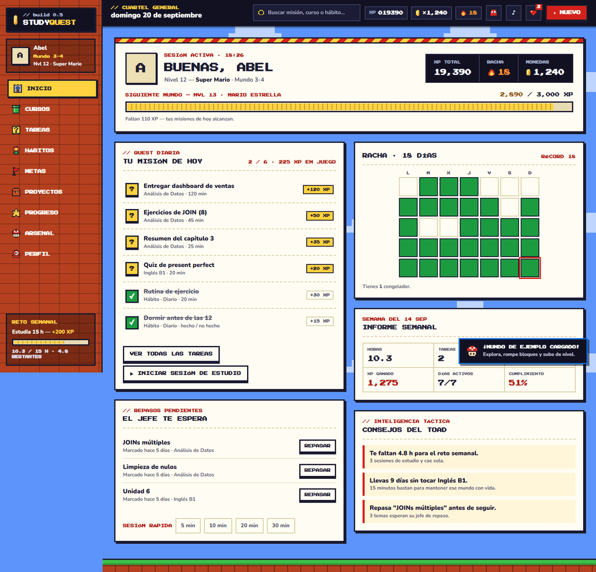

</div>

---

## Contenido

- [Qué incluye](#qué-incluye)
- [Capturas](#capturas)
- [Inicio rápido](#inicio-rápido)
- [Configurar Supabase](#configurar-supabase)
- [Desplegar en Render](#desplegar-en-render)
- [Usarla como app (PWA)](#usarla-como-app-pwa)
- [Trabajar sin conexión](#trabajar-sin-conexión)
- [Copias de seguridad](#copias-de-seguridad)
- [Recordatorios push](#recordatorios-con-repetición-y-sonido)
- [Planificador inteligente](#planificador-inteligente)
- [Tu ciudad](#tu-ciudad)
- [Repaso espaciado, calendario, jefes y Pomodoro](#repaso-espaciado-calendario-jefes-y-pomodoro)
- [Reglas del juego](#reglas-del-juego)
- [Arquitectura](#arquitectura)
- [Cambiar de base de datos](#cambiar-de-base-de-datos)
- [Modelo de datos](#modelo-de-datos)
- [Pruebas](#pruebas)
- [Problemas frecuentes](#problemas-frecuentes)
- [Límites conocidos](#límites-conocidos)
- [Créditos y marcas](#créditos-y-marcas)

## Qué incluye

### ¿Tarea, hábito, meta o proyecto?

| Es… | Elígelo si… | Ejemplo |
| --- | --- | --- |
| **Tarea** | lo haces **una vez** y se termina (quizá con fecha límite) | Entregar el informe del viernes |
| **Hábito** | lo **repites** con regularidad y quieres ver tu racha | Leer 20 minutos al día |
| **Meta** | es lo que quieres **lograr a largo plazo**, dividido en hitos | Aprender análisis de datos |
| **Proyecto** | vas a **construir y entregar** algo, hecho de partes | Mi portafolio web |

Se combinan: la *meta* es el destino, el *hábito* la constancia diaria, las *tareas* los pasos concretos y el *proyecto* lo que construyes por el camino. Una tarea que se repite (pagar el alquiler cada mes) sigue siendo una tarea; si lo que importa es la constancia y la racha, es un hábito. La app lo explica donde decides: una frase bajo el título de cada pantalla y el botón **❓ ¿Cuál uso?**, que abre una guía con **5 ejemplos de cada uno**, un apartado «Ojo: esto NO es…» (con qué es en realidad), **4 ejemplos completos** de cómo encajan (estudiar datos, sacar el B2 de inglés, ponerse en forma, lanzar un negocio), las dudas frecuentes y un **mini test** de 10 frases para practicar. También hay pistas dentro de los formularios y en el registro rápido. Si no quieres decidirlo tú, el **Planificador** lo arma todo a partir de un objetivo.

| Pantalla | Qué hace |
| --- | --- |
| **Inicio** | Misión del día (hábitos que tocan + tareas más urgentes), **con su desglose desplegable**: marca ahí mismo las subtareas de una tarea o los pasos de un hábito. Además nivel y XP, calendario de racha, informe semanal, consejos y repasos pendientes. |
| **Cursos** | Cada curso es un mundo: módulos (se desbloquean en orden), temas, rango `S/A/B+/B/C/D`, mentor y feedback. Marca temas como «necesito repasar». |
| **Tareas** | Tablero *Por jugar / En juego / Superada* con **arrastrar y soltar**, prioridad, fecha límite, subtareas, etiquetas, **repetición** (cada N días/semanas/meses) y **jefes finales con barra de vida**. |
| **Planificador** | Le dices «quiero aprender análisis de datos en 3 meses» y genera la ruta (Excel → SQL → Python → Pandas → Power BI → proyecto final) y **un plan con fechas** según tu disponibilidad, tus tareas y tus hábitos. Con **IA (Gemini, gratis)** o con plantillas. |
| **Certificaciones** | Vitrina de tus credenciales: título, quién la emite, fecha, **enlace al certificado** (se abre en una pestaña nueva), ID de credencial, caducidad con aviso y, si quieres, el curso con el que se relaciona. Cada una da XP y suma una pieza a tu museo. |
| **Apuntes** | Tu cuaderno: escribe lo que aprendes con un formato mínimo (`# título`, `- punto`, `**negrita**`, `` `código` ``). Cada apunte puede colgar de un curso y de un tema concreto, o ir suelto. Búsqueda sin tildes, etiquetas, fijar arriba y **exportar todo a Markdown** para llevártelo a Obsidian. Cada apunte suma un punto a tu biblioteca. |
| **Ciudad** | Seis edificios que **crecen con tu progreso real** (casa, biblioteca, academia, laboratorio, arena y museo), de 0 a 5 niveles, con recompensas en monedas al mejorar. También aparece resumida en Inicio. |
| **Calendario** | Vista mensual con tus tareas por fecha límite, las repeticiones futuras y los repasos de flashcards. Arrastra una tarea a otro día para reprogramarla. |
| **Repaso** | **Repaso espaciado**: los temas marcados «necesito repasar» vuelven a 1, 3, 7 y 14 días como **flashcards** que giran. |
| **Pomodoro** | Temporizador de enfoque/descanso con **música 8-bit** y un personaje que **corre mientras estudias**. Sigue vivo al cambiar de pantalla. |
| **Hábitos** | Frecuencia (diaria, días concretos, cada X días, semanal, mensual, **fechas concretas, anual y personalizada** «N veces por semana/mes»), recordatorio con **aviso repetido y sonido**, medición (minutos, páginas, veces, hecho/no hecho…), pasos de sesión, mapa de 12 semanas y aviso del día en que más fallas. Los días pasados de la tira semanal se pueden marcar, por si te olvidaste. |
| **Cadenas de hábitos** | Encadena una rutina en orden (dormir temprano → levantarse → ejercicio → estudio → proyecto). Cada eslabón es la **señal** del siguiente: la app te dice cuál toca ahora y a cuál va después, en Hábitos y en la misión de Inicio. **Nunca bloquea** —puedes registrar cualquier hábito cuando quieras— y completar la cadena entera en un día da **+100 XP**. |
| **Metas** | Árbol de hitos con habilidades y recompensa final. |
| **Proyectos** | Operación principal y *side quests* con checkpoints que dan XP. |
| **Progreso** | Horas por semana, distribución del tiempo por curso, mapa de actividad de 20 semanas. Filtro 90 días / 6 meses / todo. |
| **Arsenal** | Tienda de Toad (11 avatares, marcos, **6 mundos visuales**, insignias, poderes), **42 logros** y recompensas personales de la vida real. |
| **Personajes** | **21 avatares** con arte pixel propio (búho, mago, ninja, astronauta, zorro, pingüino, rana, murciélago, ajolote, dragón…) y **cada uno con su gesto de reposo**: el fantasma flota, el slime se aplasta, el ninja parpadea de sitio, el dragón respira. Se ven moviéndose ya en la tienda, antes de comprarlos. |
| **Perfil** | Camino de aprendizaje, insignias, ajustes, instalar la app, **recordatorios**, **exportar/importar tu partida**, cerrar sesión y reiniciar partida. |

Además: sesiones de estudio con temporizador, búsqueda global, notificaciones, modo día/noche, efectos de sonido 8-bit (sintetizados, sin archivos), pantalla de *level up* con lluvia de monedas, y diseño responsive con barra inferior y botón `?` flotante en móvil.

## Capturas

<table>
  <tr>
    <td width="50%">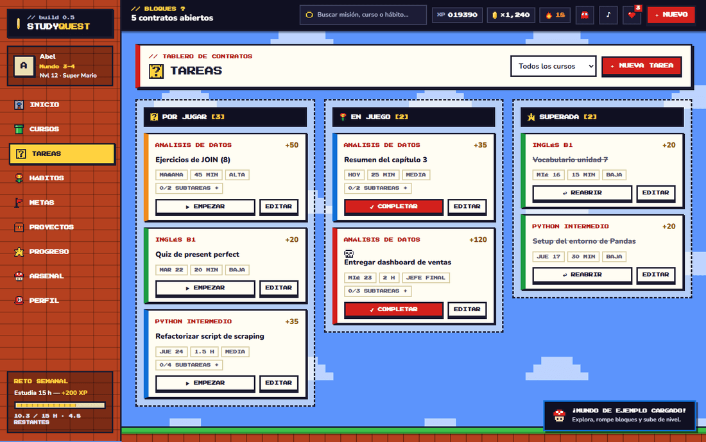<br><sub><b>Tareas</b> · tablero por estado</sub></td>
    <td width="50%">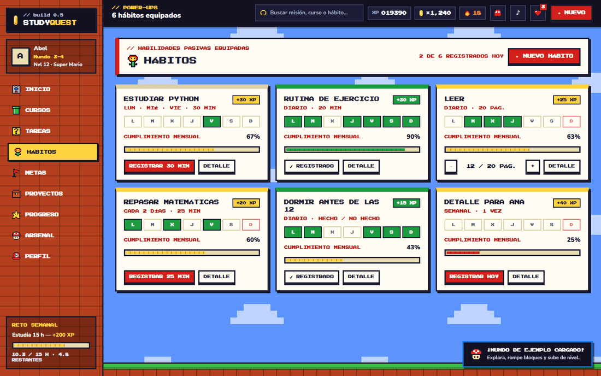<br><sub><b>Hábitos</b> · power-ups equipados</sub></td>
  </tr>
  <tr>
    <td>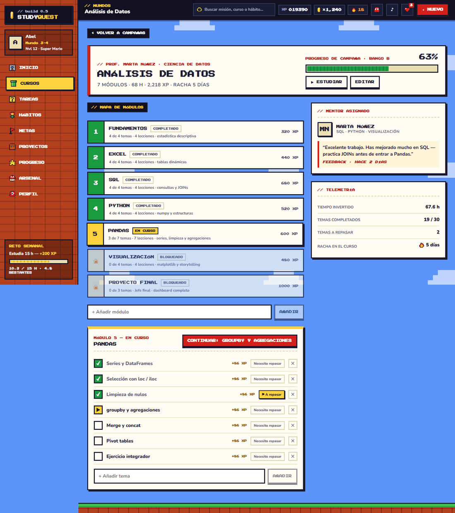<br><sub><b>Curso</b> · mapa de módulos y temas</sub></td>
    <td>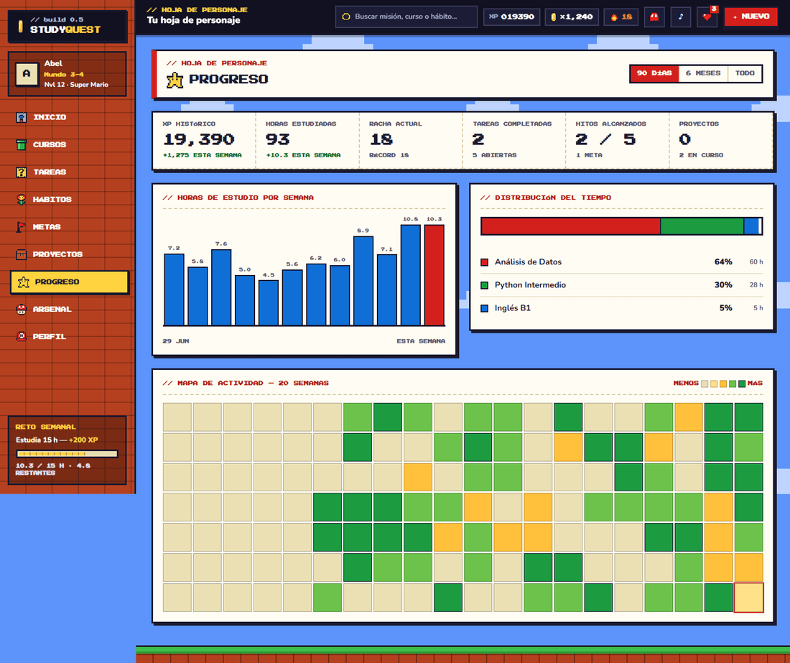<br><sub><b>Progreso</b> · horas, distribución y actividad</sub></td>
  </tr>
  <tr>
    <td>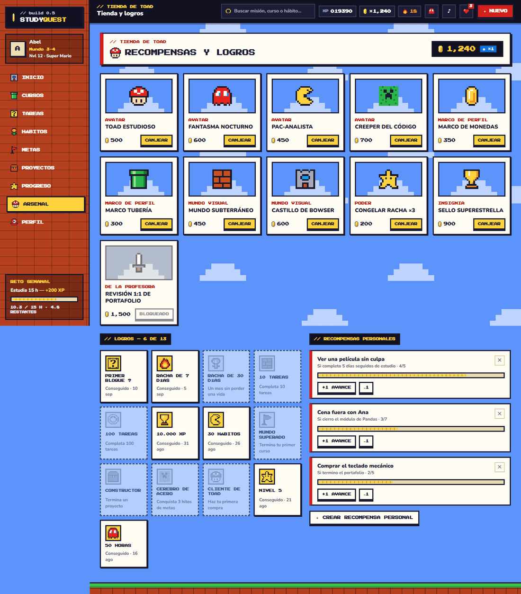<br><sub><b>Arsenal</b> · tienda, logros y premios</sub></td>
    <td>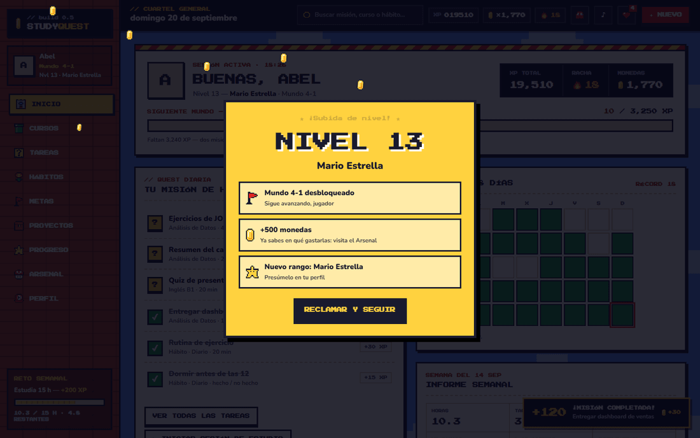<br><sub><b>Level up</b> · ¡Mundo 4-1 desbloqueado!</sub></td>
  </tr>
  <tr>
    <td>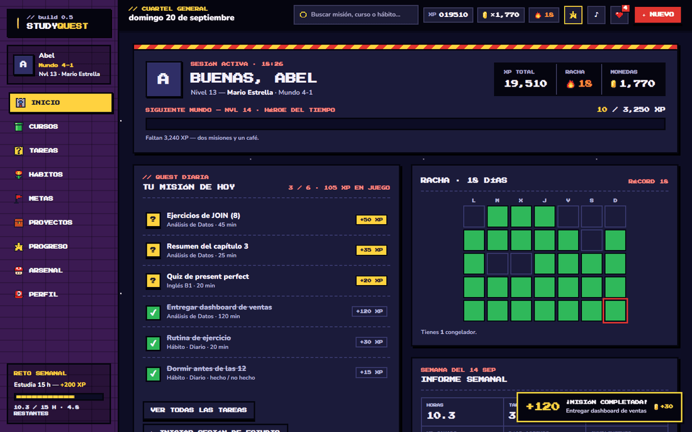<br><sub><b>Modo noche</b></sub></td>
    <td align="center">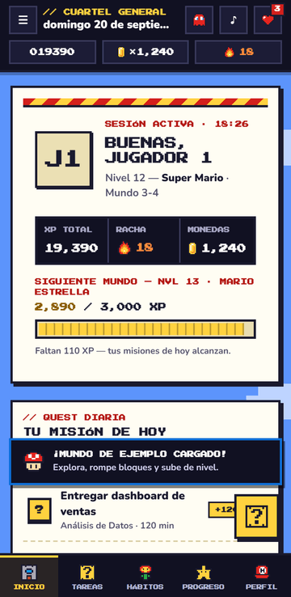 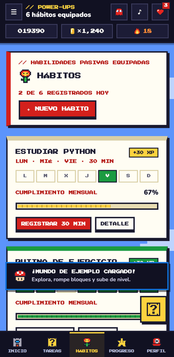<br><sub><b>Móvil</b> · barra inferior y botón <code>?</code></sub></td>
  </tr>
</table>

## Inicio rápido

**Requisitos:** Node.js 22 (mínimo 20.19) y npm.

```bash
git clone https://github.com/Abelstick/Studyquest.git
cd Studyquest
npm install
cp .env.example .env     # en PowerShell: Copy-Item .env.example .env
npm run dev              # http://localhost:5173
```

El `.env.example` viene con `VITE_DATA_PROVIDER=local`, así que la app funciona desde el primer momento **sin backend ni login**: guarda todo en el navegador. En el primer arranque te ofrece cargar un **mundo de ejemplo** (3 cursos, tareas, hábitos y 100 días de historial, nivel 12 con racha de 18 días) o empezar de cero. Para usar Supabase, sigue [la siguiente sección](#configurar-supabase).

| Comando | Qué hace |
| --- | --- |
| `npm run dev` | Servidor de desarrollo con recarga en caliente |
| `npm run build` | Typecheck estricto + build de producción (genera el service worker) |
| `npm run preview` | Sirve el build para probar la PWA de verdad |
| `npm test` | Pruebas unitarias (Vitest) |
| `npm run typecheck` | Solo comprobación de tipos |
| `npm run icons` | Regenera los iconos PNG de la PWA desde el sprite del bloque `?` |
| `npm run worlds` | Regenera el decorado de los mundos (`src/styles/worlds.css`). |
| `npm run vapid` | Genera un par de claves VAPID para los [recordatorios push](#recordatorios-push-opcional) |

## Configurar Supabase

1. Crea un proyecto en [supabase.com](https://supabase.com).
2. Ve a **SQL Editor**, pega el contenido de [`supabase/migrations/0001_init.sql`](supabase/migrations/0001_init.sql) y ejecútalo. Crea las tablas y activa **Row Level Security**: cada usuario solo puede ver y modificar sus propias filas. Ejecuta después [`0005_certifications.sql`](supabase/migrations/0005_certifications.sql) y [`0006_notes.sql`](supabase/migrations/0006_notes.sql), que añaden las tablas de certificaciones y apuntes. **Si ya tenías la base creada antes**, te basta con ejecutar esa última.
3. En **Project Settings → API** copia la *Project URL* y la clave *anon public* en tu `.env`:

   ```ini
   VITE_DATA_PROVIDER=supabase
   VITE_SUPABASE_URL=https://xxxxxxxx.supabase.co
   VITE_SUPABASE_ANON_KEY=eyJhbGciOi...
   ```

4. En **Authentication → URL Configuration** añade tus URL permitidas: la de producción (`https://tu-app.onrender.com`) y `http://localhost:5173`. Sin esto, los enlaces de confirmación y el enlace mágico redirigen a un sitio equivocado.
5. *(Opcional)* En **Authentication → Providers → Email**, desactiva *Confirm email* mientras pruebas para poder entrar sin confirmar el correo.

### Iniciar sesión con Google

La pantalla de acceso ofrece **«Continuar con Google»** como opción principal (el correo y la contraseña quedan debajo, plegados). La pantalla es un pequeño nivel: sprites flotando, un corredor perseguido por un jefe sobre el suelo de ladrillos, marcador de jugador y barra de carga. En el campo de contraseña, el botón **VER / OCULTAR** muestra u oculta lo que escribes, avisa si tienes **Bloq Mayús** activado y, al crear cuenta, un medidor de **Poder** (Débil → Épica) orienta sobre la fuerza. Para activarlo, una sola vez:

1. En [Google Cloud Console](https://console.cloud.google.com/) crea (o elige) un proyecto → **APIs y servicios → Pantalla de consentimiento de OAuth** (tipo *Externo*; basta con nombre de la app y tu correo).
2. **Credenciales → Crear credenciales → ID de cliente de OAuth → Aplicación web**. En **URI de redireccionamiento autorizados** pon exactamente la URL de callback de Supabase: `https://<tu-ref>.supabase.co/auth/v1/callback` (la ves en Supabase → Authentication → Providers → Google).
3. Copia el **ID de cliente** y el **Secreto**. En Supabase → **Authentication → Providers → Google**, actívalo y pégalos.
4. En **Authentication → URL Configuration** deben estar tu URL de Render y `http://localhost:5173` (paso 4 de arriba): a ellas vuelve el usuario tras elegir su cuenta.

No hace falta ninguna variable nueva ni migración: la sesión de Google entra por el mismo camino que la de correo, y los datos siguen protegidos por RLS. Si aún no has configurado Google, el botón mostrará el error del proveedor; puedes ocultarlo con `VITE_GOOGLE_LOGIN=false`.

> 🔐 **Seguridad.** La clave `anon` es pública por diseño: lo que protege tus datos son las políticas RLS del SQL. **Nunca** uses la clave `service_role` en el frontend. El archivo `.env` está en `.gitignore`; no lo subas al repositorio.

## Desplegar en Render

La app es una **SPA estática**: Render solo sirve archivos y el backend es Supabase. El repo incluye [`render.yaml`](render.yaml) con todo lo necesario.

### Con Blueprint (recomendado)

1. Sube el proyecto a GitHub.
2. En Render: **New → Blueprint**, elige el repositorio (o pulsa el botón *Deploy to Render* de arriba).
3. Render pide `VITE_SUPABASE_URL` y `VITE_SUPABASE_ANON_KEY`. Pégalos.
4. A partir de ahí, cada `git push` a la rama principal despliega solo.

### A mano (Static Site)

> ⚠️ Elige **Static Site**, no *Web Service*. Un Web Service intenta ejecutar `npm run start` tras el build (y te da `Missing script: "start"`); esta app son solo archivos estáticos.

| Campo | Valor |
| --- | --- |
| Build Command | `npm ci && npm run build` |
| Publish Directory | `dist` |
| Environment | `NODE_VERSION=22`, `VITE_DATA_PROVIDER=supabase`, `VITE_SUPABASE_URL`, `VITE_SUPABASE_ANON_KEY` |
| Redirects/Rewrites | `/*` → `/index.html` (**Rewrite**, no Redirect) |

### Lo que ya está resuelto en `render.yaml`

- **Rutas de React Router:** la reescritura `/* → /index.html` evita el 404 al recargar `/tareas` o abrir un enlace directo.
- **Caché correcta para la PWA:** `sw.js`, `manifest.webmanifest` e `index.html` van con `no-cache` (si no, los usuarios se quedan con una versión vieja); `assets/*` van con caché inmutable de un año (llevan hash en el nombre).
- Cabeceras `X-Content-Type-Options` y `Referrer-Policy`.

> ⚠️ Las variables `VITE_*` se **incrustan en el build**. Si las cambias en Render, hay que lanzar un nuevo despliegue (*Manual Deploy → Clear build cache & deploy*).

## Usarla como app (PWA)

- **Android / Chrome / Edge:** abre la web y pulsa *Instalar app* (Perfil → Ajustes) o el icono de instalar de la barra de direcciones.
- **iPhone / iPad:** Safari → *Compartir* → *Añadir a pantalla de inicio*.
- **Sin conexión:** todo el código se precachea, así que la app abre sin red, y con Supabase **también puedes guardar cambios sin conexión** (ver [Trabajar sin conexión](#trabajar-sin-conexión)).
- **Actualizaciones:** cuando hay versión nueva aparece un aviso «Actualizar».
- **Accesos directos:** mantén pulsado el icono para *Nueva tarea* o *Hábitos de hoy*.
- Las peticiones a `*.supabase.co` **nunca** se cachean: los datos siempre son los reales.

Para probar la PWA en local usa `npm run build && npm run preview` (el service worker no está activo en `npm run dev`).

## Trabajar sin conexión

Marca hábitos, completa tareas o registra estudio **sin red** (metro, avión, wifi malo): todo se guarda en el dispositivo y se envía solo al volver la conexión.

- Al perder la red, el marcador superior muestra `OFFLINE`. Cada cambio guardado en el dispositivo suma al aviso `⏳ N pendientes` (púlsalo para reintentar ya).
- Al volver la red se envían **en orden** y aparece «Sincronizado».
- La cola vive en **IndexedDB**: sobrevive a cerrar la app, recargar o apagar el móvil.
- Es un decorador ([`src/data/offline`](src/data/offline)) que envuelve **cualquier** adaptador remoto; el local no lo necesita.

**Reglas y límites que conviene saber**

- Un rechazo del servidor que **no** es de red (permisos, dato inválido) descarta ese cambio y te avisa, para no bloquear la cola para siempre.
- Con cambios pendientes la app no recarga datos del servidor (pisaría lo que aún no se envió): usa tu copia local hasta sincronizar.
- Conflictos: gana el último cambio enviado (*last write wins*). Si editas lo mismo desde dos dispositivos a la vez, uno pisa al otro.
- Los cambios de una cuenta solo se envían con esa cuenta iniciada.
- Hay que haber abierto la app **al menos una vez con conexión** (para cachearla y haber iniciado sesión). Pasada la hora de vida del token, la app sigue abriendo offline con tu último usuario; al volver la red renueva la sesión y sincroniza.
- Varias pestañas abiertas a la vez no se coordinan entre sí.

## Copias de seguridad

**Perfil → Cuenta y datos → Exportar copia (.json)** descarga toda tu partida: tareas, hábitos, cursos, historial, monedas, compras y logros. **Importar copia** la restaura (reemplaza lo que tengas: te pide confirmación y te muestra qué contiene).

- Sirve como **respaldo**, para **pasar de un dispositivo a otro** y para **migrar de base de datos** (exportas con un adaptador, importas con otro).
- El archivo lleva versión. Si es de una versión más nueva de la app, se rechaza con un mensaje claro.
- Al importar se **valida** todo: descarta elementos inválidos y los avisa, regenera ids que no sean UUID reescribiendo las referencias, y quita registros huérfanos (un registro de hábito sin hábito, una sesión de un curso inexistente).
- No está cifrado: contiene tus datos en claro. Guárdalo donde guardarías cualquier documento personal.

## Recordatorios (con repetición y sonido)

Cada hábito puede tener una hora de recordatorio (p. ej. 19:00) y un intervalo de repetición: **No repetir · cada 15 min · cada 30 min (por defecto) · cada hora**. A esa hora avisa **solo si ese día toca y aún no lo has hecho**, y **insiste cada N minutos hasta que lo marques como hecho** (máximo **6 avisos al día**; nunca cruza la medianoche). Al marcarlo hecho, deja de avisar.

Hay dos canales que funcionan a la vez y **no se duplican**:

| Canal | Cuándo | Cómo avisa | Necesita |
| --- | --- | --- | --- |
| **Dentro de la app** | Con la app abierta | Banner naranja que te lleva al hábito + el sonido «1-UP» (respeta el botón de sonido de la barra superior) | Nada: funciona también en modo local |
| **Push** | Con la app cerrada o en otra pestaña | Notificación del sistema | Supabase + activarlo en Perfil (ver abajo) |

- Con la pestaña **visible**, el aviso del servidor no muestra notificación del sistema: se lo pasa a la propia web, que suena y muestra el banner. Si el servidor y la web disparan el mismo aviso a la vez, solo se ve uno.
- Con la pestaña **oculta** y push activado, avisa el sistema. Sin push pero con permiso de notificaciones, la app muestra una notificación del sistema.
- El sonido en una pestaña oculta puede quedar bloqueado por el navegador si no has interactuado con la página desde que la abriste.

> ⚙️ Los **push** requieren **Supabase** (un servidor que envíe los avisos) y un dispositivo compatible: Chrome/Edge/Firefox en escritorio y Android, e **iPhone/iPad con iOS 16.4+ con la app instalada** en la pantalla de inicio (en Safari normal no funciona).

**Cómo funcionan los push:** un cron de Supabase llama cada minuto a la Edge Function [`send-reminders`](supabase/functions/send-reminders/index.ts). Esta le pide al planificador ([`_shared/reminders.ts`](supabase/functions/_shared/reminders.ts), **el mismo código que usa la web**, así nunca discrepan) qué avisos tocan ahora para cada usuario con dispositivos suscritos, según su hora local (la zona horaria de su dispositivo). Cada aviso se reserva en `reminder_log` de forma atómica (contador y hora del último), así que **nunca se envía dos veces** aunque la función se ejecute a la vez dos veces. El servidor usa además las mismas reglas de «¿toca hoy?» que la app: una prueba compara ambas con miles de casos.

**Puesta en marcha (una vez):**

1. **Claves VAPID:** `npm run vapid`. Copia la *pública* en `VITE_VAPID_PUBLIC_KEY` (tu `.env` y las variables de Render, y vuelve a desplegar). La *privada* solo va a Supabase, nunca al frontend ni a git. Si cambias las claves, todos los dispositivos deben volver a activar los recordatorios.
2. **Migraciones:** ejecuta en el SQL Editor, por orden, [`0002_push_reminders.sql`](supabase/migrations/0002_push_reminders.sql) y [`0003_reminder_repeats.sql`](supabase/migrations/0003_reminder_repeats.sql) (esta última añade el contador de avisos para poder repetirlos).
3. **Secretos y función** con la [CLI de Supabase](https://supabase.com/docs/guides/cli). No hace falta instalarla (se usa con `npx`), ni Docker, ni `supabase link`. Tu `<ref>` es la parte `xxxx` de `https://xxxx.supabase.co`.

   ```bash
   # 1) Iniciar sesión (abre el navegador; solo la primera vez)
   npx supabase login

   # 2) Crea un archivo `supabase.secrets.local` (ya está en .gitignore por acabar en .local) con:
   #      VAPID_PUBLIC_KEY=<la pública de npm run vapid>
   #      VAPID_PRIVATE_KEY=<la privada de npm run vapid>
   #      VAPID_SUBJECT=mailto:tu@correo.com
   #      CRON_SECRET=<cadena larga aleatoria, p. ej. node -e "console.log(require('crypto').randomBytes(24).toString('hex'))">
   npx supabase secrets set --env-file supabase.secrets.local --project-ref <ref>

   # 3) Desplegar la función
   npx supabase functions deploy send-reminders --no-verify-jwt --use-api --project-ref <ref>
   ```

   - `--no-verify-jwt`: la llama el cron, no un usuario; la protege `CRON_SECRET`.
   - `--use-api`: empaqueta en el servidor de Supabase, así no necesitas Docker.
   - `VAPID_SUBJECT` debe empezar por `mailto:` o `https://`, o la función falla al arrancar.
   - Comprueba que existe: Supabase → **Edge Functions** → debe aparecer `send-reminders`. Y `CRON_SECRET` debe ser el **mismo** valor que pongas en el paso 4.
4. **Cron:** en Database → Extensions activa `pg_cron` y `pg_net`; abre [`supabase/cron.sql.example`](supabase/cron.sql.example), rellena `<TU_CRON_SECRET>` y `<TU_PROJECT_REF>` y ejecútalo en el SQL Editor.
5. **En la app:** Perfil → Recordatorios → *Activar recordatorios* (acepta el permiso del navegador) y ponle hora a un hábito. El botón *Probar* muestra una notificación local para comprobar que el sistema las enseña.

**Probarlo sin esperar a la hora:**

```bash
curl -X POST https://<tu-project-ref>.supabase.co/functions/v1/send-reminders -H "x-cron-secret: <CRON_SECRET>"
# → {"ok":true,"users":1,"sent":1,"removed":0}
```

Pon la hora del recordatorio en los últimos 10 minutos (el primer aviso acepta esa ventana por si un minuto se retrasa). Para volver a probar el primer aviso el mismo día, borra la fila de `reminder_log` (`delete from reminder_log;`). Las **repeticiones** no salen hasta que pase el intervalo del hábito desde el último aviso. Si algo no llega, mira **Edge Functions → send-reminders → Logs** y `select * from cron.job_run_details order by start_time desc limit 10;`.

**Privacidad:** se guarda por dispositivo el *endpoint* de push, sus claves públicas y tu zona horaria (tabla `push_subscriptions`, con RLS). Al **cerrar sesión** el dispositivo se da de baja de los recordatorios de esa cuenta.

## Planificador inteligente

Pantalla **Planificador** (o el botón «Planificar con el asistente» en Metas). Tres pasos:

1. **Objetivo**: «Quiero aprender análisis de datos», el plazo (1, 2, 3, 6 meses o una fecha) y tu nivel.
2. **Tiempo**: cuánto puedes estudiar cada día de la semana (pasos de 15 min), con atajos («1 h al día», «solo fines de semana»…) y los días que no puedes (viajes, exámenes). La app **descuenta lo que ya tienes**: tareas con fecha y hábitos medidos en minutos u horas.
3. **Plan**: eliges de dónde sale la ruta (**tu propia ruta desde cero**, una **plantilla** o la **IA**) y la **editas por completo**: nombre de la meta, módulos (nombre, horas, orden, añadir/quitar), temas y los pasos del proyecto final. Verás una línea de tiempo con las fechas de cada tramo, y avisos como *«con tu disponibilidad caben 73 h de las 135 h que pide la ruta (54%). Necesitarías ~11 h por semana o ampliar el plazo a ~23 semanas»*. Si no cabe, recorta las horas de cada módulo por igual; si sobra tiempo, te avisa del margen.

Al pulsar **Crear mi plan** se crean, de una vez: un **curso** con módulos y temas, una **meta** con un hito por módulo (y sus habilidades), **una tarea por módulo y semana** con fecha (aparecen en el calendario), el proyecto final como **jefe** con sus pasos como golpes, y un **hábito** «Estudiar …» en tus días libres.

**De dónde sale el temario.** El *reparto en el tiempo* lo calcula siempre código propio (probado con tests, sin IA). El *temario* puede venir de:

| Origen | Cuándo | Coste |
| --- | --- | --- |
| **Tu propia ruta** | Empiezas en blanco y pones tú los módulos, temas y horas. No necesita IA ni plantilla. | Gratis |
| **Plantillas** | Editables después de elegirlas. Siempre disponibles, incluso sin conexión y en modo local: análisis de datos, desarrollo web, inglés, diseño UX/UI y marketing digital. Sugiere la que encaja con lo que escribiste. | Gratis |
| **IA (Gemini)** | Cualquier objetivo («preparar el examen de admisión», «aprender guitarra»…). Funciona en cualquier modo (local o Supabase). Cada persona usa **su propia clave**. | Gratis dentro de la cuota gratuita de Google AI Studio |

### Funciones inteligentes: cada usuario pone su propia clave

Las funciones con IA **están apagadas hasta que la persona las activa con su clave gratuita de Gemini**. La app se lo pide donde hace falta:

- en el **Planificador** (botón «🔑 Activar funciones inteligentes»),
- al editar las **tarjetas** de un tema («🔑 Activar IA para generar tarjetas»),
- y en **Perfil → Funciones inteligentes**, donde también se comprueba o se quita.

Cómo se activa (2 minutos, sin tarjeta):

1. Entra en [Google AI Studio → API keys](https://aistudio.google.com/apikey) con tu cuenta de Google.
2. Pulsa **Create API key** y copia la clave.
3. Pégala en la ventana de StudyQuest y pulsa **Probar y activar** (la comprueba con Google sin gastar cuota).

Con la IA activa aparece **«✨ Generar con IA»** en el Planificador y **«✨ Generar 5 con IA»** en el editor de tarjetas de cada tema.

**¿La misma clave en varios dispositivos?** Sí: una clave de Google no está atada a ningún dispositivo. Al activarla eliges dónde guardarla:

| Opción | Cómo funciona | Cuándo elegirla |
| --- | --- | --- |
| **Solo en este dispositivo** *(por defecto)* | `localStorage`. No sale del navegador salvo hacia Google. En otro dispositivo se pega de nuevo. | La más privada. Funciona también en modo local. |
| **En mi cuenta, cifrada con una frase** | Se cifra en el navegador (AES-GCM de 256 bits, clave derivada de tu frase con PBKDF2-SHA256 y 250 000 iteraciones) y en Supabase solo hay texto ilegible. En otro dispositivo escribes la frase y se descifra. | Recomendada si usas varios dispositivos. Si olvidas la frase, «Olvidé mi frase» borra la copia cifrada y pegas la clave otra vez. |
| **En mi cuenta, sin cifrar** | Se guarda tal cual en tu cuenta y se activa sola al iniciar sesión en cualquier dispositivo. | La más cómoda, pero quien administre la base de datos de la app podría leerla. |

Las dos opciones de cuenta solo aparecen con Supabase y necesitan ejecutar [`0004_user_secrets.sql`](supabase/migrations/0004_user_secrets.sql) una vez (crea la tabla `user_secrets`, con RLS: cada usuario solo ve la suya). Desde Perfil → Funciones inteligentes puedes **guardarla en la cuenta más tarde**, **quitarla de este dispositivo** o **borrarla de tu cuenta**.

**Dónde vive la clave y qué se envía**

- La clave **nunca** entra en las copias de seguridad ni en la caché del perfil: la cuenta la guarda en su propia tabla (`user_secrets`), aparte de tus datos de juego.
- Viaja únicamente en la cabecera `x-goog-api-key` de las peticiones a Google, nunca por un servidor de la app. Por eso no hay nada que configurar en Render ni en Edge Functions.
- **Cerrar sesión borra la clave de ese dispositivo** (la copia de tu cuenta se conserva), para no dejarla en un ordenador compartido.
- A Google solo se envía lo que pides: el objetivo, el plazo, el nivel y las horas por semana (planificador), o el título del tema y del curso (tarjetas). **Nunca** tus tareas, hábitos ni datos personales.
- En el nivel gratuito, Google puede usar esos textos para mejorar sus productos. Si eso te importa, usa una clave de un proyecto de pago (con facturación) o las plantillas.
- **Sobre el aviso de Google.** Su documentación dice «no expongas claves en el cliente: quien abra tu web podría extraerlas». Eso se refiere a **poner tu propia clave dentro de la app**, cosa que aquí no ocurre: cada persona usa **su** clave en **su** navegador. Aun así, como vive en el navegador, cualquier código malicioso que se ejecutara en la página podría leerla. Usa una clave **solo para esto**, restríngela en Google Cloud si puedes y bórrala en AI Studio si dejas de usarla.
- **Formato de la clave.** Desde el 28 de mayo de 2026 AI Studio crea las claves nuevas como «auth keys», con otro aspecto que las antiguas (`AIza…`). La app no exige ningún formato: solo descarta lo evidentemente mal pegado (vacío, espacios o saltos de línea) y deja que Google decida al pulsar «Probar y activar».

**Cómo se llama a Gemini.** La app usa el SDK oficial [`@google/genai`](https://www.npmjs.com/package/@google/genai) (v2.3 o superior) con su **Interactions API**, con el modelo **`gemini-3.8-flash`** por defecto:

```ts
const ai = new GoogleGenAI({ apiKey });
const interaction = await ai.interactions.create({
  model: 'gemini-3.8-flash',
  input: '…lo que pide el usuario…',
  system_instruction: '…reglas del asistente…',
  store: false, // Google no guarda la conversación
  response_format: { type: 'text', mime_type: 'application/json', schema }, // JSON con forma garantizada
});
interaction.output_text; // el JSON, que la app valida antes de usarlo
```

- El SDK pesa unos 365 kB y **solo se descarga cuando se usa la IA** (no forma parte de la carga inicial ni de la caché sin conexión).
- Se envía `store: false`, así que Google no retiene la petición en su almacén de interacciones (por defecto lo haría durante 1 día en el nivel gratuito). Sin reintentos automáticos, para no gastar cuota de más.
- Todo lo que devuelve el modelo pasa por una validación estricta (textos recortados, horas acotadas, módulos vacíos descartados) antes de tocar tus datos.

### Modelos gratuitos y cambio automático

Según la [documentación de Google](https://ai.google.dev/gemini-api/docs/pricing) (revisada en septiembre de 2026), estos modelos de texto tienen **nivel gratuito**; los modelos Pro, no:

| Modelo | Nota |
| --- | --- |
| `gemini-3.8-flash` | **Por defecto.** El más inteligente de la familia Flash |
| `gemini-3.7-flash` · `gemini-3.6-flash` · `gemini-3.5-flash` | Generaciones anteriores, cada una con su propia cuota |
| `gemini-3.5-flash-lite` | Versión ligera: la más rápida y económica de la serie 3.5 |
| `gemini-2.5-flash` · `gemini-2.5-flash-lite` | Serie 2.5, estable |

> `gemini-3.1-flash-lite` no figura como gratuito y tiene fecha de retirada (mayo de 2027), por eso no se ofrece.

**Por qué cambiar de modelo ayuda.** Los límites (peticiones por minuto, tokens por minuto y peticiones por día) se aplican **por proyecto y por modelo**: cada modelo tiene su propia cuota. Crear otra clave *dentro del mismo proyecto* de Google no aporta nada. Al superar un límite Google responde `429 RESOURCE_EXHAUSTED`; el límite diario se renueva a medianoche (hora del Pacífico). Tus cifras exactas están en [aistudio.google.com/rate-limit](https://aistudio.google.com/rate-limit).

**Cómo lo gestiona la app** (Perfil → Funciones inteligentes → *Modelos*, o el selector «Modelo» del Planificador):
- **Modelo principal**: eliges uno de la lista (o escribes otro id).
- **Cambio automático** (activado por defecto): si el principal agota su cuota (429), no existe para tu clave (404) o está saturado (503), la app prueba **el siguiente modelo de reserva** y te avisa («Cambié de modelo: Gemini 3.8 Flash agotó su cuota. Sigo con Gemini 3.7 Flash»). Eliges qué modelos de reserva usar; se prueban en el orden de la lista.
- Un modelo que acaba de agotar su cuota se **aparta 5 minutos**: la siguiente petición ya no gasta un intento en él.
- Los demás errores (clave inválida, cancelación, tiempo agotado…) **no** cambian de modelo.
- Si todos agotan su cuota, el mensaje lista los que probó y cuándo se renuevan. Con el cambio automático apagado, al agotarse la cuota aparecen botones para **reintentar con otro modelo** con un clic.
- La etiqueta de la ruta generada indica qué modelo respondió.

Los límites y los nombres de modelo cambian con el tiempo: si Google retira uno, se puede escribir otro id en «Otro modelo».

## Tu ciudad

Pantalla **Ciudad** (y un resumen en Inicio). Cada área de la app es un edificio que sube de nivel (0 = solar en obras, hasta 5) con lo que ya haces: **no hay que registrar nada más**, todo se calcula a partir de tus datos.

| Edificio | Área | Puntos | Niveles (umbral de puntos) |
| --- | --- | --- | --- |
| 🏠 **Casa** | Hábitos | 1 por hábito cumplido | Tienda de campaña (5) · Cabaña (25) · Casita (75) · Casa familiar (200) · Mansión (500) |
| 📚 **Biblioteca** | Conocimiento | 1 por tema completado · 1 por repaso superado · 3 por tema dominado | Estante (5) · Librería (20) · Biblioteca (60) · Gran biblioteca (150) · Archivo legendario (350) |
| 🏫 **Academia** | Cursos | 3 por módulo completado · 10 por curso terminado · 1 por hora de estudio | Aula (6) · Escuelita (25) · Academia (70) · Instituto (160) · Universidad (350) |
| 💻 **Laboratorio** | Proyectos | 2 por checkpoint · 10 por proyecto terminado · 2 por hito de una meta | Taller (4) · Laboratorio (16) · Centro de pruebas (45) · Instituto de I+D (110) · Fábrica de ideas (250) |
| 🏟️ **Arena** | Retos | 3 por jefe derrotado · 5 por reto semanal · 2 por combo ×2 · 1 por Pomodoro | Pista (5) · Gimnasio (20) · Arena (55) · Estadio (130) · Coliseo (300) |
| 🏆 **Museo** | Logros y certificaciones | 1 por logro desbloqueado · 1 por certificación registrada | Vitrina (3) · Sala de honor (8) · Museo (16) · Gran museo (28) · Palacio de los récords (40) |

- **Mejorar un edificio da monedas**: +50, +100, +200, +400 y +800 por alcanzar los niveles 1 a 5, con aviso y mensaje en el buzón. Si saltas varios niveles a la vez, cobras todos. Deshacer o borrar datos **no baja** lo ya conseguido ni repite premios.
- **Sin premios retroactivos**: la primera vez que se comprueba la ciudad solo se anota tu punto de partida (no se regalan monedas por progreso anterior a la ciudad).
- El **rango de la ciudad** sube con la suma de niveles (0-30): Terreno en obras → Aldea (3) → Pueblo (8) → Ciudad (14) → Metrópolis (21) → Capital legendaria (28). Al crecer aparecen árboles, una fuente, farolas y banderas, y suma **habitantes** (tu XP y cada mejora).
- Al pulsar un edificio ves sus 5 niveles con su recompensa, **cómo se ganan los puntos**, cuánto falta y un botón a la pantalla donde mejorarlo. La ciudad te señala cuál está **más cerca de subir**.
- Los edificios se **dibujan por código** (cada uno tiene 5 niveles que crecen y ganan detalles), y hay **5 logros nuevos** (Primera piedra, Sin solares vacíos, Alcalde, Urbanista y Obra maestra). El nivel de cada edificio ya celebrado se guarda en tu perfil (también en las copias de seguridad).

## Repaso espaciado, calendario, jefes y Pomodoro

**Repaso espaciado (Repaso).** Marca un tema como *«Necesito repasar»* dentro de un curso: reaparece **al día siguiente** y, cada vez que lo recuerdas, a los **3, 7 y 14 días**. Fallar reinicia la escalera; superar los cuatro escalones deja el tema **dominado** (+40 XP). Cada repaso superado da +10 XP. Las tarjetas son tuyas: botón **♪ Tarjetas** en cada tema, una por línea con el formato `pregunta :: respuesta` (si no hay ninguna, se te pregunta si recuerdas el tema). Atajos: `espacio` gira la tarjeta, `1` `2` `3` califican. La agenda se ve también en el calendario y en el menú (insignia con lo que toca hoy).

**Calendario.** Tareas por fecha límite (color por prioridad, ↻ las repetidas, tachadas las hechas), repeticiones futuras proyectadas y repasos. Pulsa un día para ver su detalle y crear una tarea con esa fecha; arrastra una tarea a otro día para moverla.

**Tareas recurrentes.** En el formulario, *Repetir*: cada N días, semanas o meses. Al completarla **nace la siguiente**, con su nueva fecha y sin avance. La fecha sigue el calendario original pero nunca cae en el pasado (completar tarde no crea una cola de atrasadas; 31 ene + 1 mes = 28/29 feb). Si la reabres y nadie tocó la siguiente, esta se retira.

**Apuntes.** El cuerpo se escribe en texto plano con un formato mínimo y **se analiza a una estructura de datos que la pantalla pinta con elementos de React, nunca convirtiéndolo a HTML**: así, por raro que sea lo que escribas, no puede inyectar nada en la app. Los apuntes viven en su propia tabla y no dentro del documento del curso, a propósito: los cursos se reescriben enteros cada vez que marcas un tema, y arrastrar todos los apuntes en cada marca sería tirar ancho de banda a la basura. Si borras un curso, sus apuntes **se conservan** y solo pierden el vínculo.

**Fondos por capas.** El fondo de cada mundo no es un color plano: son cuatro capas a distinta profundidad, como el fondo de un juego de plataformas — **cielo** en degradado, **lo que flota en él** (nubes, estrellas, luna en cuarto creciente, burbujas, copos, sol), **silueta lejana** (colinas, montañas, dunas, almenas, árboles secos) y **detalle cercano** (arbustos, pinos, cactus, algas, lápidas, brillo de lava). Todo es pixel art dibujado con rectángulos, sin una sola imagen que descargar: se genera con `npm run worlds` en [`scripts/gen-worlds.mjs`](scripts/gen-worlds.mjs) y sale como data-URIs dentro del CSS. Comprimido, la hoja de estilos entera pesa unos 20 KB, y el scroll no se resiente (medido: 16,6 ms por fotograma con decorado frente a 16,5 sin él).

**Mundos con material propio.** Cada mundo comprable no cambia solo el fondo: cambia el **suelo** (hierba, piedra, arena mojada, hielo, adobe, tablones), la **textura del muro** de la barra lateral y el **color de acento** que tiñe los detalles. Los siete mundos están comprobados en día y noche: el texto de la barra pasa el contraste mínimo en los catorce combinados.

**Reproductor de música.** Ocho melodías chiptune con play/pausa, anterior/siguiente, orden aleatorio, volumen y lista, en la pantalla de Pomodoro. **Todas son composiciones originales hechas para StudyQuest**: no se usa ninguna banda sonora de ningún juego, porque esas están protegidas por derechos de autor y transcribirlas a notas sería reproducirlas igual que subir un MP3. Se sintetizan en el momento con Web Audio, así que no hay un solo archivo de audio y suenan también sin conexión. Durante una sesión de Pomodoro manda la música de la sesión y, al terminar, vuelve lo que estuvieras escuchando. La canción y el volumen se recuerdan; nunca arranca sola al abrir la app (los navegadores exigen un gesto tuyo).

**Sonido.** 24 efectos 8-bit sintetizados con Web Audio, sin un solo archivo que descargar: moneda, salto, golpe al bloque, power-up, 1-UP, tubería, pisotón, estrella, pausa, cuenta atrás de los últimos 5 segundos del Pomodoro, victoria, game over… Todo se apaga con el interruptor de sonido del Perfil.

**Borrar un plan sin dejar restos.** El planificador crea cuatro cosas a la vez —curso, meta, hábito y tareas— y ahora las marca con un mismo `planId`. Al borrar el curso, el aviso te dice **qué más vino con ese plan** y te ofrece borrarlo también, con una casilla marcada por defecto. Antes, la meta y el hábito se quedaban sueltos. Para los planes creados antes de esta marca, se reconocen por su forma (el planificador siempre pone el mismo nombre a la meta y llama al hábito «Estudiar X», y firma el curso como *Plan inteligente*); como es una suposición, **nunca se borra nada sin enseñártelo antes** en el aviso.

**Ponerse al día con un hábito olvidado.** Si un día lo hiciste pero se te olvidó marcarlo, puedes rellenarlo: en la tira de la semana de cada hábito, los días pasados **se pueden pulsar** (los olvidados salen con borde discontinuo) y arriba se avisa de cuántos llevas sin marcar. Lo importante es que el XP **se fecha en el día al que corresponde**, no en hoy: como la racha se calcula con los días que tienen XP, marcar el día olvidado **repara la racha**, que es justo para lo que sirve.

Los límites son a propósito: solo **los últimos 7 días**, nunca el futuro, nunca antes de crear el hábito, y solo los días que tocaban según su frecuencia. Sin límite, la racha y las estadísticas dejarían de significar nada. Los **bonos del día** (fin de semana, combo ×2, cadena) **no se cobran hacia atrás**: son mecánicas de «hoy». El store valida la fecha por su cuenta, sin fiarse de la pantalla.

**Cadenas de hábitos.** Una cadena es una rutina en orden, la técnica de «apilar hábitos»: el anterior es la señal del siguiente. Se guía y se premia, **nunca se bloquea**, porque un día malo no debe impedirte apuntar lo que sí hiciste ni costarte la racha. Los hábitos que hoy no tocan (por su propia frecuencia) no cuentan ni estorban. Un hábito pertenece como mucho a una cadena, y si lo borras la cadena se queda sin ese eslabón (y desaparece si se queda en uno solo). Las cadenas viven en tu perfil, así que **no necesitan ninguna migración** y viajan en las copias de seguridad.

**Desglose y «listo para completar».** Las tareas con subtareas y los hábitos con pasos de sesión se despliegan en Inicio y en Tareas, y se marcan sin abrir nada más. Cuando marcas el último, la tarea **no se cierra sola**: se resalta en verde con un aviso y su botón pasa a «✔ Completar», para que decidas tú cuándo darla por terminada (y cuándo cobrar el XP). La excepción son los jefes finales, que sí caen con el último golpe.

**Jefes finales.** Una tarea con prioridad *Jefe final* y subtareas es una batalla: **cada subtarea es un golpe** y le quita un corazón. Al caer el último, el jefe se derrota solo: pantalla de **victoria**, su XP y un **botín extra de +50 XP**. Reabrir el jefe le devuelve toda la vida.

**Pomodoro.** 25 min de enfoque + 5 de descanso (configurable), y descanso largo cada 4. Cada enfoque terminado se registra como sesión de estudio (2 XP/min). Suena una melodía 8-bit animada para estudiar y otra tranquila para descansar (**original y sintetizada**, sin archivos); se controla con el botón «Música 8-bit». El reloj aparece en la barra superior desde cualquier pantalla y en el título de la pestaña, y sobrevive a recargar la página.

**Eventos de racha.**

| Evento | Cuándo | Qué da |
| --- | --- | --- |
| **Bonus de fin de semana** | Sábado y domingo, por cada hábito completado | **+50%** de su XP |
| **Combo ×2** | Al completar **3 hábitos** en el mismo día | Duplica el XP de esos hábitos (tope 200) |
| **Cofre diario** | Una vez al día en Inicio | 20–60 monedas + 2 por cada día de racha (máx. +60) y, a veces, +25 XP |

Los bonos se cobran **una sola vez** (se anotan en el perfil): deshacer y rehacer un hábito no los repite.

**Mundos y logros.** Seis mundos visuales (subterráneo, castillo, **submarino, montaña nevada, desierto, casa encantada**), siete avatares nuevos (slime, invasor 8-bit, dino, gato, robot, caballero, mini jefe), marcos de fuego/hielo/real, insignias y **42 logros** (repaso, jefes, Pomodoro, combos, rachas largas, coleccionismo…).

## Reglas del juego

| Concepto | Regla |
| --- | --- |
| **Nivel** | El nivel *L* cuesta `250 × L` XP (nivel 12 → 3 000 XP). Cada nivel tiene un mundo (`3-4`) y un rango. |
| **Monedas** | 1 moneda por cada 4 XP. Subir de nivel da +500. Cada logro da su premio. |
| **Tarea** | Da su XP al pasar a *Superada*. Reabrirla lo devuelve. Prioridad: baja 20 · media 35 · alta 50 · jefe final 120 (+50 de botín al derrotarlo). |
| **Hábito** | Da su XP al alcanzar el objetivo del día, **una sola vez**. Bajar del objetivo lo devuelve. |
| **Tema de curso** | XP del módulo repartido entre sus temas. |
| **Sesión de estudio** | 2 XP por minuto (también cada Pomodoro de enfoque). |
| **Repaso** | +10 XP por repaso superado; +40 más al dominar el tema. |
| **Reto semanal** | Alcanzar tus horas objetivo (15 h por defecto) desbloquea +200 XP. |
| **Racha** | Días consecutivos con XP neto positivo. Si hoy aún no hay actividad, la racha de ayer sigue viva hasta que acabe el día. |
| **Congelar racha** | Poder de la tienda (×3): marca un día como activo sin ganar XP. |
| **Progreso de curso** | Temas completados / totales. Un módulo se completa con todos sus temas y desbloquea el siguiente. |

## Arquitectura

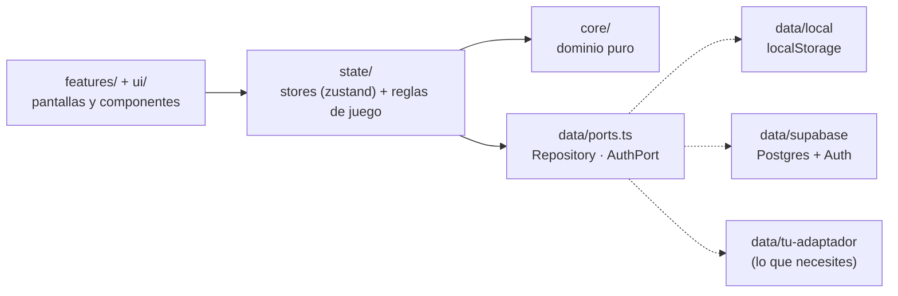

```
src/
├─ core/       Dominio puro (sin React ni BD): tipos, niveles y XP, rachas, hábitos,
│              logros, catálogo de la tienda, misiones y datos de ejemplo
├─ data/
│  ├─ ports.ts      ← contratos: Repository y AuthPort
│  ├─ local/        ← adaptador localStorage (y almacén en memoria para tests)
│  ├─ supabase/     ← adaptador Supabase: tablas, columnas, RLS y auth
│  ├─ offline/      ← decorador con cola de escritura offline (IndexedDB), válido para cualquier adaptador
│  └─ index.ts      ← ÚNICO sitio que decide qué adaptador se usa
├─ state/      data.ts (datos + reglas de juego) · ui.ts (toasts, modales, tema, sonido)
├─ features/   Una carpeta por pantalla, más layout y modales
├─ ui/         Componentes base y sprites pixel-art (sprites.ts)
├─ audio/      Efectos 8-bit con Web Audio
└─ pwa/        Hooks de conexión e instalación, y cliente de notificaciones push
supabase/
├─ migrations/   Esquema SQL con RLS (0001 base · 0002 recordatorios · 0005 certificaciones · 0006 apuntes)
├─ functions/    Edge Function `send-reminders` (+ `_shared/due.ts`, espejo de las reglas de «¿toca hoy?»)
└─ cron.sql.example   Programación del envío cada minuto
public/push-sw.js      Manejo de notificaciones dentro del service worker
docs/screenshots/      Capturas del README
```

**Decisiones de diseño que conviene conocer**

- **UI optimista con reversión.** Cada acción actualiza la pantalla al instante y se guarda en segundo plano; si falla, se revierte y se avisa. Las escrituras pasan por una cola que conserva el orden.
- **Los ids los genera el cliente** (`crypto.randomUUID`), así crear es idempotente y no depende del servidor.
- **Documentos `jsonb` + tablas relacionales.** Tareas, hábitos, cursos, metas y proyectos tienen estructura anidada que cambia a menudo (módulos → temas, subtareas, hitos), así que se guardan como documentos. Los registros de actividad (`habit_logs`, `study_sessions`, `xp_events`, `notifications`) son tablas relacionales porque se agregan por fecha.
- **Tienda y logros viven en código** (`core/catalog.ts`, `core/achievements.ts`): cambiarlos no exige migración.
- **Fechas de negocio = día local `YYYY-MM-DD`, no UTC.** Así «hoy» es hoy en tu zona horaria (con UTC, a las 19:00 en Perú ya sería «mañana»).
- **Sprites propios.** Son cuadrículas de texto (`sprites.ts`) que se dibujan como SVG nítido; una prueba comprueba que cada una está bien formada.

## Cambiar de base de datos

La app solo conoce las interfaces `Repository` y `AuthPort` ([`src/data/ports.ts`](src/data/ports.ts)). Para migrar a Firebase, PocketBase, tu propia API…:

**1.** Crea `src/data/pocketbase/index.ts` que devuelva un `DataLayer`:

```ts
import type { DataLayer } from '../ports';

export function createPocketBaseDataLayer(url: string): DataLayer {
  return {
    kind: 'pocketbase',          // amplía la unión `kind` en ports.ts
    repo: { /* profile, tasks, habits, habitLogs, courses, goals, projects,
               personalRewards, sessions, xpEvents, notifications, wipe */ },
    auth: { /* required, getUser, onChange, signInWithPassword, signUp,
                signInWithMagicLink, signInWithGoogle, signOut */ },
  };
}
```

**2.** Regístralo en [`src/data/index.ts`](src/data/index.ts):

```ts
if (provider === 'pocketbase') return createPocketBaseDataLayer(env.VITE_POCKETBASE_URL);
```

**3.** Pon `VITE_DATA_PROVIDER=pocketbase` y listo. El store, las pantallas y las reglas de juego no cambian. [`src/data/local/local.test.ts`](src/data/local/local.test.ts) sirve de modelo para probar el adaptador nuevo.

Puntos a respetar en el adaptador: `habitLogs.upsert` debe ser **único por hábito y día**; `habitLogs.removeByHabit` borra de golpe el historial de un hábito (al borrarlo); `create` debe ser **idempotente** por id (se usa también para guardar cambios en lote); y `wipe()` debe borrar todo lo del usuario. `repo.push` es opcional (solo si tu backend puede enviar recordatorios). Si tu backend es remoto, envuélvelo con `withOfflineQueue(...)` en `data/index.ts` y ganas el trabajo sin conexión gratis. Las copias de seguridad JSON funcionan con cualquier adaptador y permiten llevarte tus datos de uno a otro.

## Modelo de datos

| Tabla | Tipo | Contenido |
| --- | --- | --- |
| `profiles` | `data jsonb` | Nombre, XP, monedas, inventario, equipado, logros, congeladores |
| `tasks` · `habits` · `courses` · `goals` · `projects` · `personal_rewards` | `data jsonb` | Entidades con estructura anidada |
| `habit_logs` | relacional | `habit_id`, `day`, `value`, `steps_done` — único por `(user_id, habit_id, day)` |
| `study_sessions` | relacional | `day`, `minutes`, `course_id` |
| `xp_events` | relacional | `day`, `amount`, `source`, `label` — fuente de la racha y del mapa de actividad |
| `notifications` | relacional | `category`, `title`, `body`, `read` |
| `push_subscriptions` | relacional | Dispositivos suscritos a push: `endpoint`, claves, `timezone` — único por `(user_id, endpoint)` *(migración 0002)* |
| `reminder_log` | relacional | Avisos ya enviados, `(user_id, habit_id, day)`. Solo accesible por la Edge Function *(migración 0002)* |

Todas llevan `user_id` (por defecto `auth.uid()`) y una política RLS «solo el dueño».

## Cargadores y esperas

Todo lo que tarda se ve: el **cargador animado** (un personaje corriendo por el suelo de ladrillos, un mensaje que va cambiando —«Leyendo tu objetivo», «Eligiendo los módulos»…—, la barra de carga, los segundos transcurridos y cuánto suele tardar) aparece cuando la IA diseña una ruta o crea tarjetas, y mientras se cargan las pantallas. Los botones que trabajan muestran una **moneda girando** y se bloquean para que no se pulsen dos veces. Las llamadas a la IA se pueden **cancelar de verdad** (se aborta la petición a Google, sin mensaje de error) y se cortan solas a los 60 segundos. Si sales de la pantalla mientras la IA trabaja, se cancela.

## Pruebas

```bash
npm test
```

Cubren la lógica que más importa:

- **Juego:** curva de niveles, rachas (huecos, días congelados, deshacer) y **todas** las frecuencias de hábito (incluido el 29 de febrero).
- **Store completo** contra un repositorio en memoria: XP y monedas al completar/deshacer, subida de nivel, compras, reversión si falla el guardado, mundo de ejemplo y reinicio.
- **Cola offline:** orden de envío, recuperación tras reiniciar, rechazos del servidor, lecturas con cambios pendientes, cuentas distintas.
- **Copia de seguridad:** ida y vuelta sin pérdidas, archivos inválidos, ids regenerados y referencias huérfanas.
- **Servidor de recordatorios:** paridad de «¿toca hoy?» con la app en más de 15 000 casos aleatorios, y la hora local por zona horaria.
- **Planificador de avisos** (compartido por servidor y web): primer aviso, repeticiones, tope de 6, «no repetir», hábito hecho, zonas horarias y medianoche; y el reparto entre banner, notificación del sistema y silencio según la pestaña.
- **IA con la clave del usuario:** el cliente de Gemini con el SDK simulado (la petición exacta: modelo, `store:false`, JSON con esquema, sin reintentos; errores con la forma real del SDK: clave inválida, 401/403/404/429, tiempo agotado, sin red; respuestas vacías o ilegibles; la clave nunca aparece en mensajes), el almacén de la clave (formato, corrupción, modo privado, que no entre en copias de seguridad), el cifrado (ida y vuelta, frase incorrecta, datos manipulados, la clave no aparece en el texto cifrado), la sincronización con la cuenta entre dispositivos y la limpieza de tarjetas generadas.
- **Planificador:** validación de lo que devuelve la IA (basura, textos enormes, módulos vacíos), lectura de la respuesta de Gemini, reparto en el tiempo (orden, sin pasarse de tu disponibilidad diaria, recorte si no cabe, días bloqueados, agenda ocupada, cada tema una sola vez), plantillas y creación del plan.
- **Modelos y cambio automático:** el catálogo son exactamente los modelos con nivel gratuito según la documentación (sin Pro ni `3.1-flash-lite`); pasar al siguiente modelo con 429, 404 y 503 y avisar; no cambiar con errores que no son de cuota; una sola tentativa si el cambio está apagado; mensaje cuando todos se agotan; cancelar en mitad de la cadena; apartar 5 minutos al modelo agotado; ajustes guardados y a prueba de valores manipulados.
- **Cancelar y tiempo máximo de la IA:** la petición se aborta con «Cancelar» (y no se llega a enviar si ya estaba cancelada), se corta a los 60 s y no deja temporizadores pendientes.
- **Guía de conceptos:** cada concepto con 5 ejemplos distintos, sus «esto NO es» apuntando a otro concepto, ejemplos completos y el mini test con respuestas repartidas.
- **Ciudad:** niveles exactos de cada edificio (umbrales), puntos de cada área, rangos, adornos y habitantes; premios al mejorar (una sola vez, saltos de varios niveles, sin retroactivos, sin bajar al borrar datos); el arte de los 6 edificios × 6 niveles (cuadrícula regular, solo colores de la paleta, cada nivel distinto, sin recortes) y el flujo real: 5 hábitos suben la Casa.
- **Novedades:** intervalos 1-3-7-14 y dominio del tema, repeticiones de tareas (meses cortos, completar tarde, reabrir), vida de los jefes y victoria, bonus de fin de semana y combo (una sola vez, reinicio diario), cofre, cuadrícula del calendario, fases del Pomodoro y validez de las partituras.
- Validez de todos los sprites, del catálogo y de los logros, y del decodificador de la clave VAPID (con la clave normalizada y validada).

## Problemas frecuentes

| Síntoma | Causa y solución |
| --- | --- |
| Aparece el **login** en local | Tu `.env` tiene `VITE_DATA_PROVIDER=supabase`. Cámbialo a `local` para trabajar sin backend. |
| Inicias sesión pero **no se guarda nada** / error `relation "…" does not exist` | No has ejecutado la migración. Corre `0001_init.sql` en el SQL Editor. |
| Error `42501` / `row-level security` | La migración se ejecutó a medias. Vuelve a lanzarla completa (es idempotente). |
| `Invalid API key` | Copiaste la clave equivocada o quedó cortada. Usa la *anon public* de Project Settings → API. |
| El enlace del correo lleva a `localhost` o a un sitio equivocado | Falta tu URL en Authentication → URL Configuration. |
| En Render: `npm error Missing script: "start"` | Creaste un *Web Service*. Lo correcto es un **Static Site** (gratis, sin servidor) o usar el Blueprint. Si prefieres seguir con Web Service: Start Command `npm start` (el repo ya trae ese script; sirve `dist` en el `PORT` de Render). |
| En Render, recargar `/tareas` da **404** | Falta la regla *Rewrite* `/* → /index.html` (ya está en `render.yaml`). |
| Cambié las variables en Render y no pasa nada | Son variables de *build*: lanza un nuevo despliegue. |
| La PWA no se actualiza | Cierra todas las pestañas o pulsa «Actualizar» en el aviso. Comprueba que `sw.js` no esté cacheado por un CDN. |
| El planificador no muestra «Generar con IA» | Falta activar las funciones inteligentes: pulsa «🔑 Activar funciones inteligentes» (o ve a Perfil) y pega tu clave de Google AI Studio. |
| «Eso no parece una clave: no puede estar vacía ni llevar espacios» | Se copió con espacios o saltos de línea en medio, o solo un trozo. Vuelve a copiarla entera desde Google AI Studio (el botón de copiar, sin seleccionar a mano). |
| Al guardar la clave en mi cuenta sale un error | Falta ejecutar `0004_user_secrets.sql` en el SQL Editor de Supabase. La clave sí funciona en el dispositivo mientras tanto. |
| Al guardar un apunte sale un error | Falta ejecutar `0006_notes.sql` en el SQL Editor de Supabase (crea la tabla `notes`). |
| Al registrar una certificación sale un error al guardar | Falta ejecutar `0005_certifications.sql` en el SQL Editor de Supabase (crea la tabla `certifications`). |
| Puse un enlace y la certificación se guardó sin él | Solo se aceptan enlaces `http(s)`. Pega la dirección completa, por ejemplo `https://coursera.org/verify/ABC123`. |
| «Frase incorrecta» al desbloquear | La frase es la que elegiste al guardarla (distingue mayúsculas). Si la perdiste, pulsa «Olvidé mi frase», que borra la copia cifrada de tu cuenta, y pega la clave otra vez (la sigues viendo en Google AI Studio). |
| «Google no aceptó tu clave» | La clave está mal copiada, borrada o restringida. Crea otra en [Google AI Studio](https://aistudio.google.com/apikey) y pégala de nuevo (Perfil → Funciones inteligentes). |
| «Se agotó la cuota gratuita…» | El modelo llegó a su límite por minuto o por día (los límites son por proyecto y por modelo). Con el cambio automático activado la app prueba otros modelos gratuitos sola; si todos se agotaron, espera unos minutos (o a medianoche, hora del Pacífico, para el límite diario) o usa una plantilla. Puedes ver tus cifras en aistudio.google.com/rate-limit. |
| «El modelo … no está disponible para tu clave» | Google retira o renombra modelos. Cambia el modelo en Perfil → Funciones inteligentes → Avanzado. |
| Los recordatorios no llegan | Comprueba en orden: (1) Perfil → Recordatorios dice «Activados»; (2) el hábito tiene hora, **hoy le toca** y no está hecho; (3) migración 0002 ejecutada; (4) función desplegada con `--no-verify-jwt` y los 4 secretos; (5) el cron corre (`cron.job_run_details`); (6) en iPhone, la app está instalada y es iOS 16.4+. Prueba la función con el `curl` de la sección de recordatorios. |
| Suena o avisa demasiado / no quiero repeticiones | Edita el hábito y elige **No repetir** en «Si no lo hago, avisar de nuevo». El máximo es 6 avisos al día por hábito. |
| Los avisos repetidos no llegan (solo el primero) | Falta ejecutar `0003_reminder_repeats.sql` o **volver a desplegar la función** (`npx supabase functions deploy send-reminders …`). |
| Con la pestaña abierta no suena | Pulsa cualquier botón de la app una vez (los navegadores bloquean el audio hasta que interactúas) y comprueba que el botón `♪` de la barra superior no esté silenciado. |
| En Perfil → Recordatorios sale «Falta la clave pública VAPID» | Falta `VITE_VAPID_PUBLIC_KEY` en el build. Añádela (`.env` / Render) y **vuelve a desplegar**. |
| En Perfil → Recordatorios sale «El service worker no está activo» | Estás en `npm run dev`. Usa `npm run build && npm run preview`. |
| Muestra `⏳ N pendientes` y no baja | Sigues sin conexión o la sesión caducó. Con red, púlsalo para reintentar; si la sesión caducó, vuelve a iniciar sesión (los cambios pendientes se conservan). |
| Al importar dice «No parece una copia de StudyQuest» | Solo se admiten archivos exportados desde Perfil → Exportar copia. |
| «Continuar con Google» da error `provider is not enabled` o `redirect_uri_mismatch` | Falta activar Google en Supabase → Authentication → Providers, o el *URI de redireccionamiento* de Google Cloud no es exactamente `https://<ref>.supabase.co/auth/v1/callback`. Ver [Iniciar sesión con Google](#iniciar-sesión-con-google). |
| Al entrar con Google sale `{"error":"requested path is invalid"}` | Es Supabase rechazando la URL de retorno. En **Authentication → URL Configuration**: pon como **Site URL** la de tu app (`https://tu-app.onrender.com`, sin barra final ni rutas) y en **Redirect URLs** añade `https://tu-app.onrender.com/**` y `http://localhost:5173/**`. Comprueba también que `VITE_SUPABASE_URL` sea solo `https://<ref>.supabase.co`. |
| Tras elegir la cuenta de Google vuelvo a la pantalla de acceso o a otra URL | Tu URL no está en Supabase → Authentication → URL Configuration (Site URL y Redirect URLs). |
| Perfil → Recordatorios dice «La clave VITE_VAPID_PUBLIC_KEY no es válida» (o el navegador da `applicationServerKey is not valid`) | La variable de Render está mal: debe ser la clave **pública** (87 caracteres, sin comillas ni espacios; la privada tiene 43). Corrígela, y en Render usa *Manual Deploy → Clear build cache & deploy*. El mensaje indica cuántos caracteres detecta. |
| No suena la música del Pomodoro | Pulsa **Empezar** (el navegador exige un clic antes de reproducir audio) y revisa «Música 8-bit» y el botón `♪` de la barra superior. |
| Supabase limita los correos | El plan gratuito envía pocos correos por hora. Para pruebas, desactiva *Confirm email* o usa contraseña en vez de enlace mágico. |

## Límites conocidos
- **Cola offline sin coordinación entre pestañas** y con *last write wins* ante conflictos entre dispositivos.
- **Arrastrar y soltar solo con ratón/trackpad.** En pantallas táctiles y con teclado se usan los botones *Empezar / Completar / Reabrir*.
- **Recordatorios con precisión de minuto**: el primer aviso admite hasta 10 minutos de retraso (si el cron falla más, ese día no llega), el intervalo mínimo entre repeticiones es 15 min y la zona horaria es la del último dispositivo activado.
- **El aviso dentro de la app solo funciona con la app abierta** (una pestaña en segundo plano puede ralentizar sus temporizadores hasta ~1 min). Con la app cerrada solo avisa el push.
- Si marcas un hábito como hecho **sin conexión**, el servidor no lo sabe hasta que sincronice y puede llegar algún aviso de más.


## Créditos y marcas

Proyecto personal sin fines comerciales. Los sprites son dibujos propios inspirados en la estética 8-bit; **Mario, Luigi, Yoshi, Pac-Man, Zelda, Minecraft, Sonic, Metroid y demás nombres o personajes mencionados pertenecen a sus respectivos dueños** y se usan solo como guiño. Fuentes: [Press Start 2P](https://fonts.google.com/specimen/Press+Start+2P) y [Nunito](https://fonts.google.com/specimen/Nunito) (SIL Open Font License), empaquetadas con [Fontsource](https://fontsource.org).
