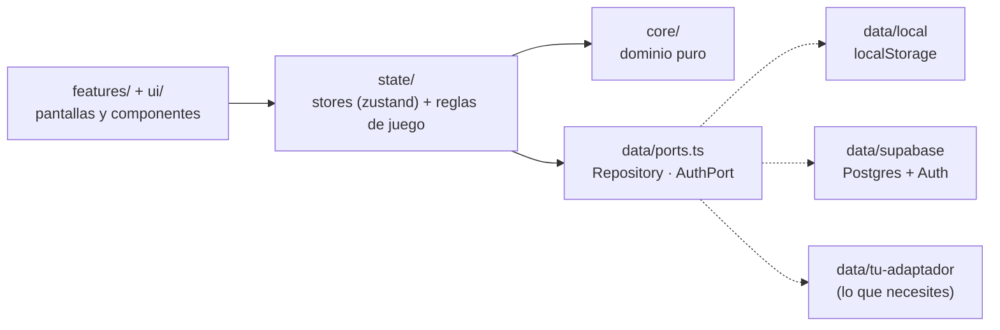

<div align="center">

# 🍄 StudyQuest

**Estudia como si fuera un videojuego.**
Cada tarea es un bloque `?`, cada hábito un power-up y cada curso un mundo con tuberías.
Todo da XP y monedas para subir de nivel: *Goomba despistado → Koopa → Toad → Pac-Man → … → Super Mario → Héroe del Tiempo*.


[](https://render.com/deploy?repo=https://github.com/Abelstick/Studyquest)


</div>

---

## Contenido

- [Qué incluye](#qué-incluye)
- [Capturas](#capturas)
- [Inicio rápido](#inicio-rápido)
- [Configurar Supabase](#configurar-supabase)
- [Desplegar en Render](#desplegar-en-render)
- [Usarla como app (PWA)](#usarla-como-app-pwa)
- [Reglas del juego](#reglas-del-juego)
- [Arquitectura](#arquitectura)
- [Cambiar de base de datos](#cambiar-de-base-de-datos)
- [Modelo de datos](#modelo-de-datos)
- [Pruebas](#pruebas)
- [Problemas frecuentes](#problemas-frecuentes)
- [Límites conocidos](#límites-conocidos)
- [Créditos y marcas](#créditos-y-marcas)

## Qué incluye

| Pantalla | Qué hace |
| --- | --- |
| **Inicio** | Misión del día (hábitos que tocan + tareas más urgentes), nivel y XP, calendario de racha, informe semanal, consejos y repasos pendientes. |
| **Cursos** | Cada curso es un mundo: módulos (se desbloquean en orden), temas, rango `S/A/B+/B/C/D`, mentor y feedback. Marca temas como «necesito repasar». |
| **Tareas** | Tablero *Por jugar / En juego / Superada* con prioridad (el «jefe final» da 120 XP), fecha límite, subtareas y etiquetas. |
| **Hábitos** | Frecuencia (diaria, días concretos, cada X días, semanal, mensual), medición (minutos, páginas, veces, hecho/no hecho…), pasos de sesión, mapa de 12 semanas y aviso del día en que más fallas. |
| **Metas** | Árbol de hitos con habilidades y recompensa final. |
| **Proyectos** | Operación principal y *side quests* con checkpoints que dan XP. |
| **Progreso** | Horas por semana, distribución del tiempo por curso, mapa de actividad de 20 semanas. Filtro 90 días / 6 meses / todo. |
| **Arsenal** | Tienda de Toad (avatares, marcos, mundos visuales, poderes), 13 logros y recompensas personales de la vida real. |
| **Perfil** | Camino de aprendizaje, insignias, ajustes, instalar la app, cerrar sesión y reiniciar partida. |

Además: sesiones de estudio con temporizador, búsqueda global, notificaciones, modo día/noche, efectos de sonido 8-bit (sintetizados, sin archivos), pantalla de *level up* con lluvia de monedas, y diseño responsive con barra inferior y botón `?` flotante en móvil.

## Capturas

<table>
  <tr>
    <td width="50%"><br><sub><b>Tareas</b> · tablero por estado</sub></td>
    <td width="50%"><br><sub><b>Hábitos</b> · power-ups equipados</sub></td>
  </tr>
  <tr>
    <td><br><sub><b>Curso</b> · mapa de módulos y temas</sub></td>
    <td><br><sub><b>Progreso</b> · horas, distribución y actividad</sub></td>
  </tr>
  <tr>
    <td><br><sub><b>Arsenal</b> · tienda, logros y premios</sub></td>
    <td><br><sub><b>Level up</b> · ¡Mundo 4-1 desbloqueado!</sub></td>
  </tr>
  <tr>
    <td><br><sub><b>Modo noche</b></sub></td>
    <td align="center"> <br><sub><b>Móvil</b> · barra inferior y botón <code>?</code></sub></td>
  </tr>
</table>

## Inicio rápido

**Requisitos:** Node.js 22 (mínimo 20.19) y npm.

```bash
git clone https://github.com/Abelstick/Studyquest.git
cd Studyquest
npm install
cp .env.example .env     # en PowerShell: Copy-Item .env.example .env
npm run dev              # http://localhost:5173
```

El `.env.example` viene con `VITE_DATA_PROVIDER=local`, así que la app funciona desde el primer momento **sin backend ni login**: guarda todo en el navegador. En el primer arranque te ofrece cargar un **mundo de ejemplo** (3 cursos, tareas, hábitos y 100 días de historial, nivel 12 con racha de 18 días) o empezar de cero. Para usar Supabase, sigue [la siguiente sección](#configurar-supabase).

| Comando | Qué hace |
| --- | --- |
| `npm run dev` | Servidor de desarrollo con recarga en caliente |
| `npm run build` | Typecheck estricto + build de producción (genera el service worker) |
| `npm run preview` | Sirve el build para probar la PWA de verdad |
| `npm test` | Pruebas unitarias (Vitest) |
| `npm run typecheck` | Solo comprobación de tipos |
| `npm run icons` | Regenera los iconos PNG de la PWA desde el sprite del bloque `?` |

## Configurar Supabase

1. Crea un proyecto en [supabase.com](https://supabase.com).
2. Ve a **SQL Editor**, pega el contenido de [`supabase/migrations/0001_init.sql`](supabase/migrations/0001_init.sql) y ejecútalo. Crea las tablas y activa **Row Level Security**: cada usuario solo puede ver y modificar sus propias filas.
3. En **Project Settings → API** copia la *Project URL* y la clave *anon public* en tu `.env`:

   ```ini
   VITE_DATA_PROVIDER=supabase
   VITE_SUPABASE_URL=https://xxxxxxxx.supabase.co
   VITE_SUPABASE_ANON_KEY=eyJhbGciOi...
   ```

4. En **Authentication → URL Configuration** añade tus URL permitidas: la de producción (`https://tu-app.onrender.com`) y `http://localhost:5173`. Sin esto, los enlaces de confirmación y el enlace mágico redirigen a un sitio equivocado.
5. *(Opcional)* En **Authentication → Providers → Email**, desactiva *Confirm email* mientras pruebas para poder entrar sin confirmar el correo.

> 🔐 **Seguridad.** La clave `anon` es pública por diseño: lo que protege tus datos son las políticas RLS del SQL. **Nunca** uses la clave `service_role` en el frontend. El archivo `.env` está en `.gitignore`; no lo subas al repositorio.

## Desplegar en Render

La app es una **SPA estática**: Render solo sirve archivos y el backend es Supabase. El repo incluye [`render.yaml`](render.yaml) con todo lo necesario.

### Con Blueprint (recomendado)

1. Sube el proyecto a GitHub.
2. En Render: **New → Blueprint**, elige el repositorio (o pulsa el botón *Deploy to Render* de arriba).
3. Render pide `VITE_SUPABASE_URL` y `VITE_SUPABASE_ANON_KEY`. Pégalos.
4. A partir de ahí, cada `git push` a la rama principal despliega solo.

### A mano (Static Site)

> ⚠️ Elige **Static Site**, no *Web Service*. Un Web Service intenta ejecutar `npm run start` tras el build (y te da `Missing script: "start"`); esta app son solo archivos estáticos.

| Campo | Valor |
| --- | --- |
| Build Command | `npm ci && npm run build` |
| Publish Directory | `dist` |
| Environment | `NODE_VERSION=22`, `VITE_DATA_PROVIDER=supabase`, `VITE_SUPABASE_URL`, `VITE_SUPABASE_ANON_KEY` |
| Redirects/Rewrites | `/*` → `/index.html` (**Rewrite**, no Redirect) |

### Lo que ya está resuelto en `render.yaml`

- **Rutas de React Router:** la reescritura `/* → /index.html` evita el 404 al recargar `/tareas` o abrir un enlace directo.
- **Caché correcta para la PWA:** `sw.js`, `manifest.webmanifest` e `index.html` van con `no-cache` (si no, los usuarios se quedan con una versión vieja); `assets/*` van con caché inmutable de un año (llevan hash en el nombre).
- Cabeceras `X-Content-Type-Options` y `Referrer-Policy`.

> ⚠️ Las variables `VITE_*` se **incrustan en el build**. Si las cambias en Render, hay que lanzar un nuevo despliegue (*Manual Deploy → Clear build cache & deploy*).

## Usarla como app (PWA)

- **Android / Chrome / Edge:** abre la web y pulsa *Instalar app* (Perfil → Ajustes) o el icono de instalar de la barra de direcciones.
- **iPhone / iPad:** Safari → *Compartir* → *Añadir a pantalla de inicio*.
- **Sin conexión:** todo el código se precachea, así que la app abre sin red. Con Supabase guarda además una copia de tu última partida.
- **Actualizaciones:** cuando hay versión nueva aparece un aviso «Actualizar».
- **Accesos directos:** mantén pulsado el icono para *Nueva tarea* o *Hábitos de hoy*.
- Las peticiones a `*.supabase.co` **nunca** se cachean: los datos siempre son los reales.

Para probar la PWA en local usa `npm run build && npm run preview` (el service worker no está activo en `npm run dev`).

## Reglas del juego

| Concepto | Regla |
| --- | --- |
| **Nivel** | El nivel *L* cuesta `250 × L` XP (nivel 12 → 3 000 XP). Cada nivel tiene un mundo (`3-4`) y un rango. |
| **Monedas** | 1 moneda por cada 4 XP. Subir de nivel da +500. Cada logro da su premio. |
| **Tarea** | Da su XP al pasar a *Superada*. Reabrirla lo devuelve. Prioridad: baja 20 · media 35 · alta 50 · jefe final 120 (valor por defecto, editable). |
| **Hábito** | Da su XP al alcanzar el objetivo del día, **una sola vez**. Bajar del objetivo lo devuelve. |
| **Tema de curso** | XP del módulo repartido entre sus temas. |
| **Sesión de estudio** | 2 XP por minuto. |
| **Reto semanal** | Alcanzar tus horas objetivo (15 h por defecto) desbloquea +200 XP. |
| **Racha** | Días consecutivos con XP neto positivo. Si hoy aún no hay actividad, la racha de ayer sigue viva hasta que acabe el día. |
| **Congelar racha** | Poder de la tienda (×3): marca un día como activo sin ganar XP. |
| **Progreso de curso** | Temas completados / totales. Un módulo se completa con todos sus temas y desbloquea el siguiente. |

## Arquitectura



```
src/
├─ core/       Dominio puro (sin React ni BD): tipos, niveles y XP, rachas, hábitos,
│              logros, catálogo de la tienda, misiones y datos de ejemplo
├─ data/
│  ├─ ports.ts      ← contratos: Repository y AuthPort
│  ├─ local/        ← adaptador localStorage (y almacén en memoria para tests)
│  ├─ supabase/     ← adaptador Supabase: tablas, columnas, RLS y auth
│  └─ index.ts      ← ÚNICO sitio que decide qué adaptador se usa
├─ state/      data.ts (datos + reglas de juego) · ui.ts (toasts, modales, tema, sonido)
├─ features/   Una carpeta por pantalla, más layout y modales
├─ ui/         Componentes base y sprites pixel-art (sprites.ts)
├─ audio/      Efectos 8-bit con Web Audio
└─ pwa/        Hooks de conexión e instalación
supabase/migrations/   Esquema SQL con RLS
docs/screenshots/      Capturas del README
```

**Decisiones de diseño que conviene conocer**

- **UI optimista con reversión.** Cada acción actualiza la pantalla al instante y se guarda en segundo plano; si falla, se revierte y se avisa. Las escrituras pasan por una cola que conserva el orden.
- **Los ids los genera el cliente** (`crypto.randomUUID`), así crear es idempotente y no depende del servidor.
- **Documentos `jsonb` + tablas relacionales.** Tareas, hábitos, cursos, metas y proyectos tienen estructura anidada que cambia a menudo (módulos → temas, subtareas, hitos), así que se guardan como documentos. Los registros de actividad (`habit_logs`, `study_sessions`, `xp_events`, `notifications`) son tablas relacionales porque se agregan por fecha.
- **Tienda y logros viven en código** (`core/catalog.ts`, `core/achievements.ts`): cambiarlos no exige migración.
- **Fechas de negocio = día local `YYYY-MM-DD`, no UTC.** Así «hoy» es hoy en tu zona horaria (con UTC, a las 19:00 en Perú ya sería «mañana»).
- **Sprites propios.** Son cuadrículas de texto (`sprites.ts`) que se dibujan como SVG nítido; una prueba comprueba que cada una está bien formada.

## Cambiar de base de datos

La app solo conoce las interfaces `Repository` y `AuthPort` ([`src/data/ports.ts`](src/data/ports.ts)). Para migrar a Firebase, PocketBase, tu propia API…:

**1.** Crea `src/data/pocketbase/index.ts` que devuelva un `DataLayer`:

```ts
import type { DataLayer } from '../ports';

export function createPocketBaseDataLayer(url: string): DataLayer {
  return {
    kind: 'pocketbase',          // amplía la unión `kind` en ports.ts
    repo: { /* profile, tasks, habits, habitLogs, courses, goals, projects,
               personalRewards, sessions, xpEvents, notifications, wipe */ },
    auth: { /* required, getUser, onChange, signInWithPassword, signUp,
                signInWithMagicLink, signOut */ },
  };
}
```

**2.** Regístralo en [`src/data/index.ts`](src/data/index.ts):

```ts
if (provider === 'pocketbase') return createPocketBaseDataLayer(env.VITE_POCKETBASE_URL);
```

**3.** Pon `VITE_DATA_PROVIDER=pocketbase` y listo. El store, las pantallas y las reglas de juego no cambian. [`src/data/local/local.test.ts`](src/data/local/local.test.ts) sirve de modelo para probar el adaptador nuevo.

Puntos a respetar en el adaptador: `habitLogs.upsert` debe ser **único por hábito y día**; `create` debe ser **idempotente** por id; y `wipe()` debe borrar todo lo del usuario.

## Modelo de datos

| Tabla | Tipo | Contenido |
| --- | --- | --- |
| `profiles` | `data jsonb` | Nombre, XP, monedas, inventario, equipado, logros, congeladores |
| `tasks` · `habits` · `courses` · `goals` · `projects` · `personal_rewards` | `data jsonb` | Entidades con estructura anidada |
| `habit_logs` | relacional | `habit_id`, `day`, `value`, `steps_done` — único por `(user_id, habit_id, day)` |
| `study_sessions` | relacional | `day`, `minutes`, `course_id` |
| `xp_events` | relacional | `day`, `amount`, `source`, `label` — fuente de la racha y del mapa de actividad |
| `notifications` | relacional | `category`, `title`, `body`, `read` |

Todas llevan `user_id` (por defecto `auth.uid()`) y una política RLS «solo el dueño».

## Pruebas

```bash
npm test
```

Cubren la lógica que más importa: curva de niveles, rachas (huecos, días congelados, deshacer), frecuencias de hábito, el adaptador local y el **store completo** contra un repositorio en memoria (XP y monedas al completar/deshacer, subida de nivel, compras, reversión si falla el guardado, mundo de ejemplo, reinicio) y la validez de todos los sprites.

## Problemas frecuentes

| Síntoma | Causa y solución |
| --- | --- |
| Aparece el **login** en local | Tu `.env` tiene `VITE_DATA_PROVIDER=supabase`. Cámbialo a `local` para trabajar sin backend. |
| Inicias sesión pero **no se guarda nada** / error `relation "…" does not exist` | No has ejecutado la migración. Corre `0001_init.sql` en el SQL Editor. |
| Error `42501` / `row-level security` | La migración se ejecutó a medias. Vuelve a lanzarla completa (es idempotente). |
| `Invalid API key` | Copiaste la clave equivocada o quedó cortada. Usa la *anon public* de Project Settings → API. |
| El enlace del correo lleva a `localhost` o a un sitio equivocado | Falta tu URL en Authentication → URL Configuration. |
| En Render: `npm error Missing script: "start"` | Creaste un *Web Service*. Lo correcto es un **Static Site** (gratis, sin servidor) o usar el Blueprint. Si prefieres seguir con Web Service: Start Command `npm start` (el repo ya trae ese script; sirve `dist` en el `PORT` de Render). |
| En Render, recargar `/tareas` da **404** | Falta la regla *Rewrite* `/* → /index.html` (ya está en `render.yaml`). |
| Cambié las variables en Render y no pasa nada | Son variables de *build*: lanza un nuevo despliegue. |
| La PWA no se actualiza | Cierra todas las pestañas o pulsa «Actualizar» en el aviso. Comprueba que `sw.js` no esté cacheado por un CDN. |
| Supabase limita los correos | El plan gratuito envía pocos correos por hora. Para pruebas, desactiva *Confirm email* o usa contraseña en vez de enlace mágico. |

## Límites conocidos

- **Frecuencias de hábito no incluidas:** *fechas concretas*, *anual* y *personalizado*. Están diaria, días concretos, cada X días, semanal y mensual.
- **Offline = solo lectura.** Sin conexión puedes ver tu partida, pero guardar falla con aviso y se revierte; no hay cola de escritura offline.
- **Tareas sin arrastrar y soltar:** se mueven con los botones *Empezar / Completar / Reabrir*.

## Créditos y marcas

Proyecto personal sin fines comerciales. Los sprites son dibujos propios inspirados en la estética 8-bit; **Mario, Luigi, Yoshi, Pac-Man, Zelda, Minecraft, Sonic, Metroid y demás nombres o personajes mencionados pertenecen a sus respectivos dueños** y se usan solo como guiño. Fuentes: [Press Start 2P](https://fonts.google.com/specimen/Press+Start+2P) y [Nunito](https://fonts.google.com/specimen/Nunito) (SIL Open Font License), empaquetadas con [Fontsource](https://fontsource.org).
